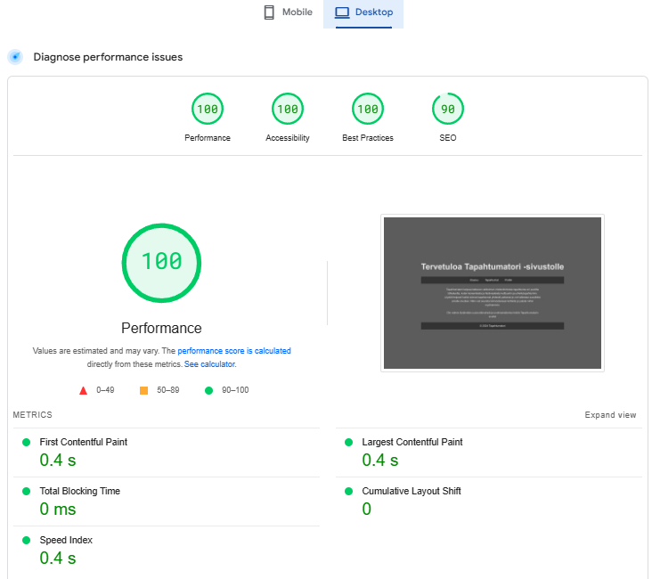

[Sivustolle linkki](Lopputyo/index.html)

## Raportit

### Responsiivisuus

Verkkosivusto on osittain responsiivinen, mutta mobiilinäkymässä on pieniä ongelmia. Esimerkiksi Profiili-välilehdellä tallennettujen tapahtumien tiedot eivät asetu täysin optimaalisesti. Yleisesti ottaen responsiivisuus toimii kuitenkin hyvin, ja reunoille jää tilaa eikä tekstit mene päällekkäin.

### Toimivuus eri selaimilla

Testasin verkkosivuston eri selaimilla SauceLabsin avulla. Käytetyt selaimet olivat:

* Google Chrome 131
* Mozilla Firefox 133
* Microsoft Edge 131

Testaaminen Safarilla ei onnistunut, sillä en päässyt edes testaustilaan.

Kaikissa testaamissani selaimissa sivuston toimivuus oli sama, eikä tullut esiin merkittäviä eroavaisuuksia eri selainten välillä. 

### Sivujen latautumisaika

Sivujen latautumisaika oli erinomainen niin mobiililaitteella kuin tietokoneellakin. Ei havaittu merkittäviä viivästyksiä tai suorituskykyongelmia molemmilla laitteilla.

