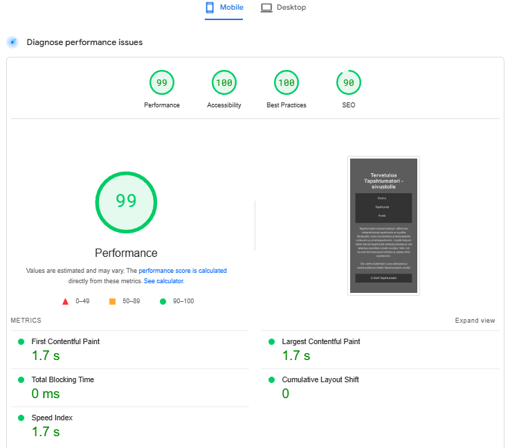

[Sivustolle linkki](Lopputyo/index.html)

## Raportit

### Responsiivisuus

Verkkosivusto on osittain responsiivinen. Joitakin ongelmia ilmenee mobiili näkymässä: profiili välilehdellä tallennettujen tapahtumien tiedot eivät asetu niin hyvin. Yleinen toimivuus on kuitenkin hyvä kaikilla näytöillä. Reunoille jää hyvin tilaa, eikä tekstit yms. mene päällekkäin.

### Toimivuus eri selaimilla

Testasin SauceLabs:lla eri selaimet: Google Chrome 131, Mozilla Firefox 133, Microsoft Edge 131.
Koitin myös testata Safarilla, mutta jostain syystä en päässyt edes testaustilaan sen kanssa.

Jokaisella selaimella näkymät olivat samanlaiset. 

### Sivujen latautumisaika

Mobiilissa ja tietokoneella sivut lautautuvat erinomaisesti.

